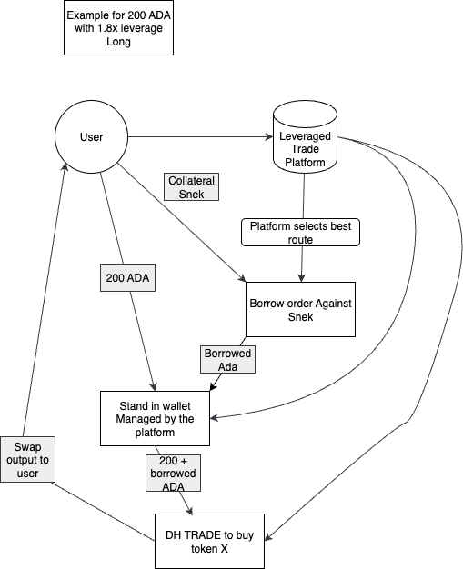

# Adding Leverage to DexHunter

## Intro

This document will cover the overall project plan for the integration of Leveraged Swaps to dexhunter.
This Project will Limit itself to the use of Snek Token for the core Implementation( it can be easily expanded by using other TokenIds) as it it is the token with the broadest liquidity on cardano.

## Infrastructure
To run this project there needs to be a cardano-node with unix-socket connection for the Data parsing. A mongoDB server for data persistance a redis server for quick access data and caches and a Dexhunter API-Key for the trading side.

To gather data we will leverage [Gouroboros](https://github.com/blinklabs-io/gouroboros)

The Program can be eventually be run as a stand alone by a user leveraging TCP connections to nodes.

## Available Leverage Sources
- [Liqwid](https://liqwid.finance/)
- [Levvy](https://levvy.fi/)
- [Flow](https://beta.flowcardano.org/)

## Lending Protocol Flows

## Overall layout

Following are the diagrams that indicate How orders will work. Generic example and Specific Long/short.
Here you can find a Specific by source abstract flow
which covers borrowing,lending and cancelling orders on lending sources.

- [Levvy](common/sources/levvy/levvy.md)
- [Liqwid](common/sources/liqwid/liqwid.md)
- [Flow](common/sources/flow/flow.md)

### Abstract Leveraged Order Flow:

#### Long Order Flow

#### Short Order Flow

#### Fulfill Long Flow

#### Fulfill Short Flow

### Leverage Sources Implementations
The Leverage Sources need to handle data parsing from blocks to Borrow or lend operations.
They need to provide Functions to do the following Operations:

- Place Lend/ Borrow order
- Cancel Lend / Borrow order
- Fulfill Lend/ Borrow order
- Analyze Block for new Info

## TODOs:
- [ ] Create Initial Golang Structs to handle data gathering
- [ ] Initial vendor Interfaces for adding Leverage sources
- [ ] Wire Data gathering from Node data feed
- [ ] Create the various Leverage sources implementations
- [ ] Create Engine that decides from which source the leverage should be taken
- [ ] Add Stand in burner wallet for handling the lent deposit and the subsequent trade
- [ ] Handle Trade using Dexhunter API

## Deliverables
The full project is going to be public under this repo.

### Disclaimer:
`The Data provided in this File can be changed at any times with development as things might change and/or some initial ideas would not work or need changing.`