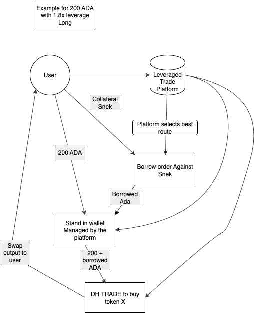

## Infrastructure

### Core Components

#### Blockchain Infrastructure
- **Cardano Node**: Full node with Unix socket connection for real-time blockchain data parsing
  - Syncs with Cardano mainnet for transaction monitoring
  - Provides access to UTxO state and smart contract interactions
  - Can be run locally or accessed via remote TCP connection
  - Alternative: Use existing node infrastructure via TCP/IP connection

#### Data Storage Layer
- **MongoDB (v7.0+)**: Primary database for persistent data storage
  - Stores historical leverage positions and orders
  - Maintains user transaction history
  - Indexes lending protocol states
  - Handles complex queries for analytics
  
- **Redis (v7.2+)**: High-performance caching and real-time data store
  - Caches frequently accessed lending rates
  - Stores active order book data
  - Manages session states and temporary data
  - Provides pub/sub for real-time updates

#### External Services
- **DexHunter API**: Trading execution and market data
  - Handles swap execution on supported DEXs
  - Provides real-time price feeds
  - Manages order routing and slippage protection
  - Required API key for authentication

### Data Pipeline Architecture

#### Blockchain Data Ingestion
We leverage [Gouroboros](https://github.com/blinklabs-io/gouroboros) for efficient blockchain data processing:
- **Chain Sync Protocol**: Real-time synchronization with Cardano network
- **Block Processing**: Parses and filters relevant transactions
- **UTxO Tracking**: Monitors lending protocol smart contracts
- **Event Streaming**: Pushes relevant events to processing pipeline

#### Processing Architecture
- **Worker Processes**: Dedicated workers for different lending protocols
- **Event Queue**: Redis-based queue for asynchronous processing
- **API Gateway**: RESTful API for client interactions
- **WebSocket Server**: Real-time updates for active positions

### Deployment Modes

#### Full Node Deployment
Complete infrastructure with local Cardano node:
- Self-contained and independent
- No external dependencies for blockchain data
- Higher resource requirements
- Suitable for production environments

#### Light Deployment
Using external node infrastructure:
- Lower resource requirements
- Depends on external node reliability
- Faster initial setup
- Suitable for development and testing

#### Standalone Mode (Future)
The system is designed to eventually support standalone operation:
- Direct TCP connections to remote Cardano nodes
- Minimal infrastructure requirements
- User-friendly deployment
- Suitable for individual traders

## Available Leverage Sources
- [Liqwid](https://liqwid.finance/)
- [Levvy](https://levvy.fi/)
- [Flow](https://beta.flowcardano.org/)

## Lending Protocol Flows

## Overall Layout

### System Architecture

The DH-Leverage system follows a modular, event-driven architecture designed for scalability and maintainability. The following sections detail the various flows and components that enable leveraged trading on Cardano.

### Order Flow Documentation

Detailed protocol-specific implementations can be found in the following documents:
- [Levvy Protocol Integration](common/sources/levvy/levvy.md) - Flash loan based leverage
- [Liqwid Protocol Integration](common/sources/liqwid/liqwid.md) - Collateralized lending positions
- [Flow Protocol Integration](common/sources/flow/flow.md) - Peer-to-peer lending markets

### Core Trading Flows

#### Abstract Leveraged Order Flow

The abstract flow demonstrates the universal process for executing leveraged trades regardless of the underlying lending protocol:
1. **Order Initiation**: User submits leverage parameters (amount, leverage ratio, direction)
2. **Protocol Selection**: System determines optimal lending source based on rates and availability
3. **Collateral Lock**: User's collateral is secured in smart contract
4. **Borrow Execution**: Funds are borrowed from selected protocol
5. **Trade Execution**: Combined funds are swapped via DexHunter
6. **Position Management**: System tracks position health and liquidation thresholds

#### Long Order Flow

**Objective**: Amplify exposure to price increases

**Process**:
1. **Deposit Collateral**: User deposits base token (e.g., ADA)
2. **Borrow Stablecoin**: System borrows ADA against collateral (Snek)
3. **Market Buy**: Execute buy order for target token with borrowed funds
4. **Position Tracking**: Monitor position value and health factor
5. **Close Position**: Sell tokens, repay loan, return profits/losses

**Example Scenario**:
- User deposits 1000 ADA and snek Collateral
- Borrows 1000 Ada at 2x leverage
- Buys Token tokens with combined 2000 ADA worth
- If SNEK increases 20%, user gains 40% on initial capital

#### Short Order Flow

**Objective**: Profit from price decreases

**Process**:
1. **Deposit Collateral**: User deposits ADA and Collateral
2. **Borrow Target Token**: System borrows target token against collateral
3. **Market Sell**: Immediately sell borrowed tokens for ADA
4. **Wait for Price Drop**: Monitor market for favorable conditions
5. **Buy Back and Repay**: Purchase tokens at lower price, repay loan, keep difference

**Example Scenario**:
- User deposits 1000 ADA as collateral
- Borrows 100 SNEK tokens
- Sells SNEK for ADA immediately
- If SNEK drops 20%, buy back for 800 ADA
- Profit: 200 ADA minus fees

#### Fulfill Long Flow

**Automated Execution for Long Positions**:

1. **Health Check**: Continuously monitor position health factor
2. **Liquidation Prevention**: 
   - Alert user when health factor < 1.5
   - Auto-deleverage option when health factor < 1.2
3. **Take Profit Execution**:
   - Trigger when target price is reached
   - Partial or full position closure
4. **Stop Loss Protection**:
   - Automatic closure at predetermined loss threshold
   - Slippage protection during volatile markets
5. **Settlement Process**:
   - Swap tokens back to repayment currency
   - Repay borrowed amount plus interest
   - Return remaining funds to user wallet

#### Fulfill Short Flow

**Automated Execution for Short Positions**:

1. **Borrow Rate Monitoring**: Track and optimize borrowing costs
2. **Margin Call Management**:
   - Monitor collateral ratio in real-time
   - Add collateral option before liquidation
3. **Profit Taking Strategy**:
   - Scale out of position at multiple price targets
   - Compound profits into new positions
4. **Risk Mitigation**:
   - Automatic buy-back if price rises beyond threshold
   - Emergency exit strategies during black swan events
5. **Final Settlement**:
   - Buy back borrowed tokens at market price
   - Return tokens to lending protocol
   - Calculate and distribute profits/losses

### Leverage Source Implementations
Leverage sources must handle data parsing from blocks to borrow or lend operations. They need to provide functions for the following operations:

- Place lend/borrow orders
- Cancel lend/borrow orders
- Fulfill lend/borrow orders
- Analyze blocks for new information

This will allow for the protocol to be expanded to include various other tokens and sources without too much hassle.
